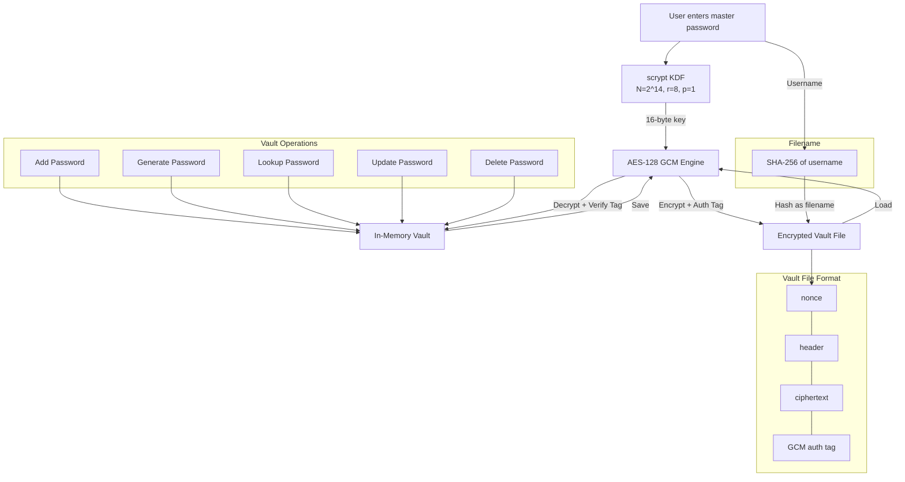

# Secure Vault

> Authenticated encryption password manager built from cryptographic primitives.


AES-128 GCM for confidentiality and integrity in one pass. scrypt key derivation
resistant to GPU/ASIC brute-force. SHA-256 hashed vault filenames so no plaintext
usernames touch disk. 27-case test suite covering tamper detection, multi-user
isolation, and wrong-password rejection.

## By the numbers

| Metric | Value |
|---|---|
| Encryption | AES-128 GCM (authenticated encryption) |
| Key derivation | scrypt (N=2^14, r=8, p=1) |
| Derived key size | 128 bits |
| Test cases | 27 across 8 categories |
| Attack vectors covered | 5 (wrong key, corrupted ciphertext, cross-user isolation, unicode, large data) |
| Password entropy | ~95 bits (16-char random from 62-char alphabet) |
| Integrity verification | GCM auth tag + magic-string canary |
| Runtime deps | 1 (pycryptodome) |
| Source | 1 module, 228 LOC |

## What it is

Secure Vault is a local password manager that encrypts an entire credential
database with a single master password. Every operation — store, retrieve,
update, delete — runs against an encrypted vault file that never exists in
plaintext on disk. The vault filename itself is a SHA-256 hash of the username,
so no identifiable information is exposed in the filesystem.

It was built from primitives, not wrappers: master password to ciphertext is
handled end-to-end — KDF, nonce, auth tag, serialization — without delegating
to a higher-level password-manager library.

## Key features

- **AES-128 GCM authenticated encryption.** A fresh random nonce per encryption
  operation. GCM yields confidentiality and integrity in a single pass; any
  tampering with the ciphertext is detected via the authentication tag.
- **scrypt key derivation.** Memory-hard parameters (N=2^14, r=8, p=1) resist
  GPU and ASIC brute-force. Derives a 128-bit AES key from the master password.
- **SHA-256 hashed vault filenames.** Each user's vault is stored under a
  hashed filename — no plaintext username exposure on disk.
- **Magic-string canary.** A known plaintext string is encrypted alongside the
  vault data. Successful decryption of the canary confirms the correct master
  password before any credential is surfaced. Wrong key, corrupted ciphertext,
  or tampered vault all fail closed rather than returning garbage plaintext.
- **16-character random password generator.** 62-character alphabet (A–Z, a–z,
  0–9) yields ~95 bits of entropy per generated password.
- **JSON + base64 vault format.** Nonce, header, ciphertext, and tag bundled
  into a single file suitable for any storage backend.
- **Nondeterministic saves.** Encrypting the same vault twice produces
  completely different ciphertext, so an attacker cannot tell whether contents
  changed between saves.

## Quick start

```bash
# Install dependencies
pip install -r requirements.txt

# Run the password manager
python password_manager.py

# Run the test suite
python test_vault.py
```

### Example session

```
$ python password_manager.py
enter vault username: fardin
enter vault password: ********
Password vault not found, creating a new one

Password Management
-----------------------
1 - Add password
2 - Create password
3 - Update password
4 - Lookup password
5 - Delete password
6 - Display Vault
7 - Save Vault and Quit
1
Enter username: admin
Enter password: s3cureP@ss!
Enter domain: github.com
Record Entry added

2
Enter username: deploy-bot
Enter domain: aws.amazon.com
Generated password: kR7mNx2pLqW9vB4j
Record Entry added

7
Password Vault encrypted and saved to file
```

## Architecture



### Key derivation with scrypt

The master password is not used directly as the encryption key. Raw passwords
have low entropy and non-uniform byte distributions, which makes them unsuitable
as cipher keys. Instead, the password is fed into scrypt, a memory-hard KDF.
Parameters (N=2^14, r=8, p=1) force each key derivation to consume significant
memory and CPU time. An attacker running an offline brute-force attack with
Hashcat or a GPU cluster cannot simply trade money for speed, because every
guess requires allocating real memory. The output is a 16-byte (128-bit) key
suitable for AES-128.

### AES-128 GCM authenticated encryption

The vault contents are encrypted with AES in Galois/Counter Mode, an AEAD
scheme that provides both confidentiality and integrity in a single pass. On
encryption, GCM generates a random nonce, encrypts the plaintext, and computes
an authentication tag over the ciphertext. Nonce, ciphertext, and tag are
bundled as base64-encoded JSON and written to disk.

On decryption, `decrypt_and_verify` reconstructs the cipher with the stored
nonce, decrypts the ciphertext, and verifies the authentication tag. If even a
single bit of the ciphertext, nonce, or tag has been modified, the call raises
an exception — an attacker cannot silently inject a phishing password for a
banking domain or subtly alter existing entries without detection.

### Magic-string verification

On top of GCM's built-in tag authentication, the vault prepends a known magic
string to the plaintext before encryption. After decryption, if the magic
string is not present at the start of the output, the program halts. This acts
as a decryption canary: if the master password is wrong, or the vault belongs
to a different user who happens to share the same hashed username, the magic
check catches it before any garbled data is processed.

### Vault file naming

The vault filename is the SHA-256 hash of the username. This avoids storing
usernames in plaintext on the filesystem. Each user gets an isolated vault
file, and cross-user decryption fails because different master passwords
produce different keys.

## Tech stack

| Layer | Technology |
|---|---|
| Language | Python 3.11+ |
| Cryptography | PyCryptodome (AES-GCM, scrypt, random bytes) |
| Hashing | hashlib (SHA-256) |
| Serialization | JSON, Base64 |
| Testing | stdlib asserts (27-case suite) |

## Testing

```bash
python test_vault.py
```

27 test cases across 8 categories:

1. **Key derivation.** 128-bit key output, determinism (same password → same
   key), differentiation (different passwords → different keys), and edge
   cases (single-character and 1000-character passwords).
2. **Encryption / decryption.** Round-trip verification, JSON structure
   validation, empty data, 100KB large payloads, Unicode data, nonce
   randomness (same plaintext → different ciphertext), wrong-key rejection,
   and tamper detection (bit-flipped ciphertext).
3. **Password generation.** Length validation (16 characters), character-set
   enforcement (alphanumeric only), and uniqueness across 100 generated
   passwords.
4. **Full vault round-trip.** Single entry, five entries with order
   preservation, empty vault, special characters, and long entries (200+
   character fields).
5. **Wrong-password detection.** Decryption with an incorrect master password
   raises and halts.
6. **Hashed username.** Determinism, differentiation, and SHA-256 format
   validation (64 hex characters).
7. **Vault overwrite.** Saving a second version replaces the first, and only
   the latest version is recoverable.
8. **Multi-user isolation.** Two users with separate vaults and passwords
   cannot cross-decrypt each other's data.

## Security analysis

See [`SECURITY_ANALYSIS.md`](SECURITY_ANALYSIS.md) for the full CIA-triad
analysis: confidentiality via AES-GCM, integrity via authentication tags,
and the entropy constraints of human-chosen master passwords vs. randomly
generated credentials.

## Requirements

- Python 3.11 or later
- [pycryptodome](https://pypi.org/project/pycryptodome/) for AES-GCM and scrypt

## Project context

Part of a 5-project security research portfolio covering authenticated
encryption, passive network monitoring, active reconnaissance, certificate
analysis, and binary exploitation:

- [Argus](https://github.com/FardinIqbal/argus) — passive network sniffer
- [tcpscan](https://github.com/FardinIqbal/tcpscan) — TCP scanner
- [NetSec Toolkit](https://github.com/FardinIqbal/netsec-toolkit) — certificate analyzer
- [x86 Exploit Lab](https://github.com/FardinIqbal/x86-exploit-lab) — buffer overflow research

## License

[MIT](LICENSE)
