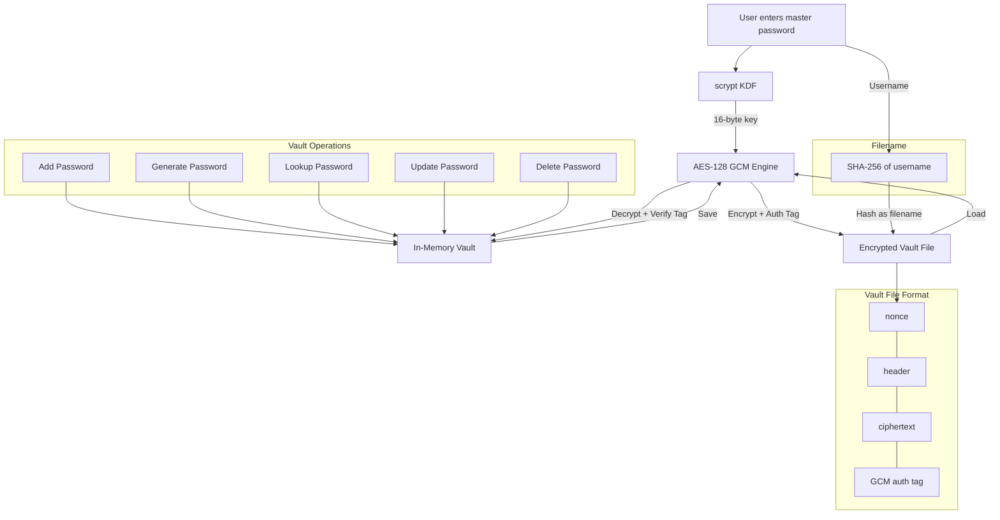

# Secure Vault

> Authenticated encryption password manager built from cryptographic primitives


During my SOC internship at NYCHA, credential theft showed up in our Splunk dashboards more than any other incident type. I wanted to understand what actually stands between an attacker and a stolen password database, so I implemented the encryption layer from scratch. Secure Vault uses AES-128 in GCM mode with scrypt key derivation and tamper-resistant vault storage.

## What It Does

Secure Vault is a local password manager that encrypts your entire credential database with a single master password. Every operation, storing, retrieving, updating, and deleting passwords, happens against an encrypted vault file that never exists in plaintext on disk. The vault filename itself is a SHA-256 hash of your username, so no identifiable information is exposed in the filesystem.

## Architecture



## Features

- AES-128 GCM authenticated encryption for confidentiality and integrity in a single pass
- scrypt key derivation function with memory-hard parameters (N=2^14, r=8, p=1) to resist GPU and ASIC brute-force attacks
- Magic string verification as a secondary decryption canary on top of GCM tag authentication
- SHA-256 hashed vault filenames so no usernames are stored in plaintext on disk
- Random 16-character alphanumeric password generator with approximately 95 bits of entropy
- JSON-encoded vault format with base64 fields for safe file storage
- Random nonce per encryption operation, so encrypting the same vault twice always produces different ciphertext
- Tamper detection on any modification to the vault file, including bit flips, truncation, and reordering

## Usage

```bash
# Install dependencies
pip install -r requirements.txt

# Run the password manager
python password_manager.py

# Run the test suite
python test_vault.py
```

## Example Output

```
$ python password_manager.py
enter vault username: fardin
enter vault password: ********
Password vault not found, creating a new one

Password Management
-----------------------
-----------------------
1 - Add password
2 - Create password
3 - Update password
4 - Lookup password
5 - Delete password
6 - Display Vault
7 - Save Vault and Quit
1
Enter username: admin
Enter password: s3cureP@ss!
Enter domain: github.com
Record Entry added

2
Enter username: deploy-bot
Enter domain: aws.amazon.com
Generated password: kR7mNx2pLqW9vB4j
Record Entry added

4
Enter domain: github.com
Username: admin
Password: s3cureP@ss!
Domain: github.com

7
Password Vault encrypted and saved to file
```

## How It Works

### Key Derivation with scrypt

When you enter your master password, it is not used directly as the encryption key. Raw passwords have low entropy and non-uniform byte distributions, which makes them unsuitable as cipher keys. Instead, the password is fed into scrypt, a memory-hard key derivation function. scrypt's parameters (N=2^14, r=8, p=1) force each key derivation to consume significant memory and CPU time. This is a deliberate design choice. An attacker running an offline brute-force attack with Hashcat or a GPU cluster cannot simply trade money for speed, because every guess requires allocating real memory. The output is a 16-byte (128-bit) key suitable for AES-128.

### AES-128 GCM Authenticated Encryption

The vault contents are encrypted with AES in Galois/Counter Mode. GCM is an authenticated encryption with associated data (AEAD) scheme, meaning it provides both confidentiality and integrity in a single cryptographic pass. During encryption, GCM generates a random 16-byte nonce, encrypts the plaintext, and computes an authentication tag over the ciphertext. The nonce, ciphertext, and tag are bundled together as base64-encoded JSON and written to disk.

During decryption, GCM reconstructs the cipher with the stored nonce, decrypts the ciphertext, and verifies the authentication tag. If even a single bit of the ciphertext, nonce, or tag has been modified, `decrypt_and_verify` raises an exception. The attacker cannot silently inject a phishing password for a banking domain or subtly alter existing entries without detection.

Because a fresh random nonce is generated for every encryption call, saving the same vault twice produces completely different ciphertext. This prevents an attacker from detecting whether vault contents changed between saves.

### Magic String Verification

On top of GCM's built-in tag authentication, the vault prepends a known magic string to the plaintext before encryption. After decryption, if this magic string is not present at the start of the output, the program halts. This acts as a decryption canary. If the master password is wrong or the vault belongs to a different user who happens to share the same hashed username, the magic string check catches it before any garbled data is processed.

### Vault File Naming

The vault filename is the SHA-256 hash of the username. This avoids storing usernames in plaintext on the filesystem. Each user gets an isolated vault file, and cross-user decryption fails because different master passwords produce different keys.

## Testing

Run the full 27-case test suite:

```bash
python test_vault.py
```

The test suite covers eight categories:

1. **Key derivation.** Verifies 128-bit key output, determinism (same password produces same key), differentiation (different passwords produce different keys), and edge cases (single-character and 1000-character passwords).
2. **Encryption and decryption.** Round-trip verification, JSON structure validation, empty data, 100KB large payloads, Unicode data, nonce randomness (same plaintext produces different ciphertext), wrong-key rejection, and tamper detection.
3. **Password generation.** Length validation (16 characters), character set enforcement (alphanumeric only), and uniqueness across 100 generated passwords.
4. **Full vault round-trip.** Single entry, five entries with order preservation, empty vault, special characters, and long entries (200+ character fields).
5. **Wrong password detection.** Confirms that decryption with an incorrect master password raises an error.
6. **Hashed username.** Determinism, differentiation, and SHA-256 format validation (64 hex characters).
7. **Vault overwrite.** Saving a second version replaces the first, and only the latest version is recoverable.
8. **Multi-user isolation.** Two users with separate vaults and passwords cannot cross-decrypt each other's data.

## Requirements

- Python 3.11 or later
- [pycryptodome](https://pypi.org/project/pycryptodome/) for AES-GCM and scrypt

## Related Projects

Part of a 5-project security research portfolio: [Argus](https://github.com/FardinIqbal/argus) (passive network sniffer), [tcpscan](https://github.com/FardinIqbal/tcpscan) (TCP scanner), [NetSec Toolkit](https://github.com/FardinIqbal/netsec-toolkit) (certificate analyzer), [x86 Exploit Lab](https://github.com/FardinIqbal/x86-exploit-lab) (buffer overflow research).

## License

[MIT](LICENSE)
