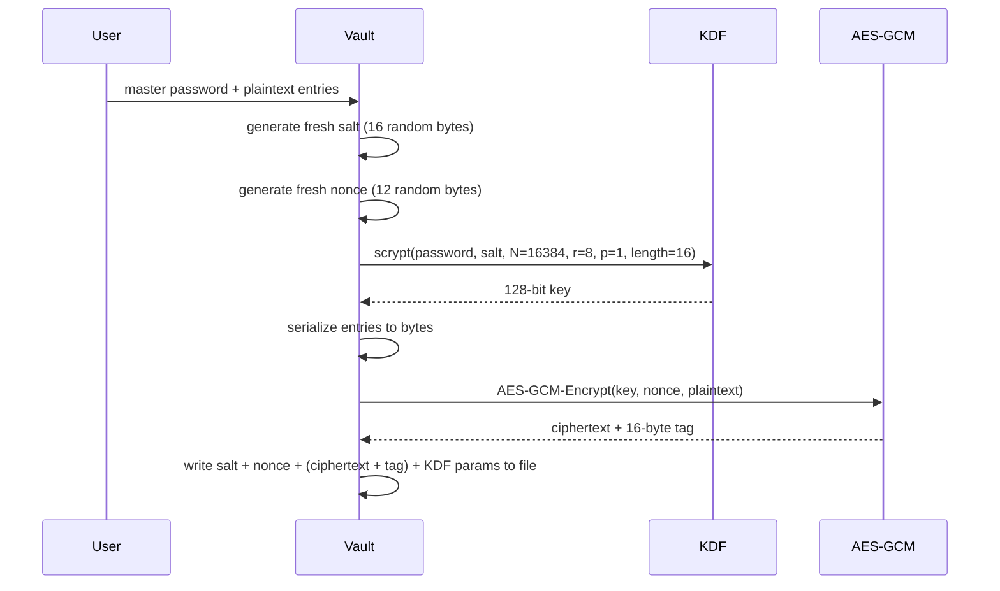
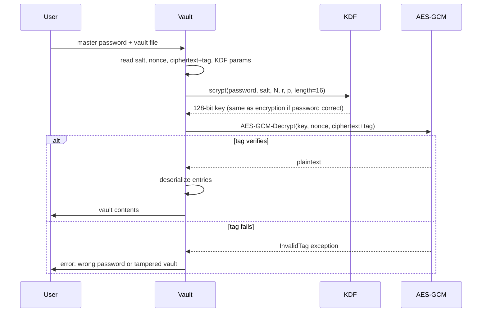

# Architecture

Deep reference for Secure Vault. The README covers the user-facing functionality and the threat model; this doc covers the cryptographic construction and key derivation.

## Cryptographic primitives

Three primitives compose the vault:

| Primitive | Purpose | Library |
|-----------|---------|---------|
| AES-128 in GCM mode | Authenticated encryption of vault data | `cryptography` |
| scrypt | Key derivation from master password | `cryptography` |
| os.urandom | Random byte generation (nonce, salt) | stdlib |

## Vault file format

```
+--------+------------+----------+--------+--------------+
| Salt   | Nonce      | Ctxt+Tag | KDF N  | KDF r, p     |
| 16 B   | 12 B       | variable | 4 B    | 1 B + 1 B    |
+--------+------------+----------+--------+--------------+
```

| Field | Size | Purpose |
|-------|------|---------|
| Salt | 16 bytes | Random salt for scrypt (different per vault) |
| Nonce | 12 bytes | AES-GCM nonce (different per encryption operation) |
| Ciphertext + tag | variable | The encrypted vault contents plus 16-byte GCM authentication tag |
| KDF parameters | 6 bytes | scrypt N (cost), r (block size), p (parallelism) |

Storing KDF parameters in the file makes the vault forward-compatible: future versions can increase scrypt cost without breaking old vaults.

## Encryption flow



## Decryption flow



The GCM tag verification is the integrity check. If the password is wrong, the derived key is wrong, and the tag does not verify. If the file was tampered with, the tag does not verify. Either failure produces the same error message (no information leak about which case it was).

## scrypt parameters

| Parameter | Value | Reason |
|-----------|-------|--------|
| N (CPU cost) | 16384 | OWASP-recommended minimum (2^14) |
| r (block size) | 8 | Standard |
| p (parallelism) | 1 | Single-threaded |
| dkLen (output) | 16 | AES-128 needs 128-bit key |

scrypt's CPU and memory costs grow with N. At N=16384, derivation takes ~100ms on commodity hardware, which is fast enough for interactive use but slow enough to make brute force expensive.

For higher-security applications, N can be increased to 65536 (2^16) or higher, at the cost of slower unlock. The KDF parameters are stored in the vault file, so changing N for new vaults does not break old ones.

## AES-GCM details

GCM (Galois Counter Mode) is an authenticated encryption mode: it provides both confidentiality (the ciphertext is unreadable without the key) and authenticity (any modification is detected via the tag).

The 12-byte nonce is critical. AES-GCM is catastrophically broken if a (key, nonce) pair is ever reused: an attacker can recover the authentication subkey and forge messages. The vault generates a fresh nonce on every encryption, ensuring uniqueness.

The 16-byte tag is appended to the ciphertext. On decryption, GCM verifies the tag before returning plaintext. If verification fails, no plaintext is returned (the implementation must not leak partial decrypted bytes).

## Threat model

| Threat | Defense |
|--------|---------|
| Attacker steals vault file | scrypt forces brute-force cost; AES-GCM ensures unreadable without password |
| Attacker tampers with vault file | GCM tag verification catches modifications |
| Attacker observes encryption/decryption timing | Constant-time crypto from `cryptography` library; no early-exit on tag failure |
| Attacker has access to memory | Master key kept in memory only during operations; cleared after (best-effort) |
| Wrong password | Tag verification fails; user gets generic error (no info about why) |
| Quantum attacker | Out of scope. AES-128 has 64-bit post-quantum security via Grover's. Acceptable for current threat models. |

## Failure modes

| Failure | Behavior |
|---------|----------|
| Wrong master password | `InvalidTag` exception; user message: "Incorrect password or corrupted vault" |
| Vault file truncated | Malformed-format error |
| Vault file with wrong KDF params | Decryption fails (key mismatch) |
| OS RNG failure | `os.urandom` raises; encryption aborts |

## Test coverage

`test_vault.py` covers:

- Encryption + decryption round-trip with known plaintext
- Wrong password produces `InvalidTag`
- Tampered ciphertext produces `InvalidTag`
- Tampered nonce produces `InvalidTag`
- Tampered salt produces `InvalidTag` (key mismatch)
- Empty vault encrypts and decrypts cleanly
- Large vault (>1MB) encrypts and decrypts correctly
- Multiple successive encryptions produce different ciphertexts (salt and nonce are fresh each time)
- KDF parameters are honored on decryption (vault saved with N=16384 cannot be opened with N=4096)

27 test cases total. All pass.
